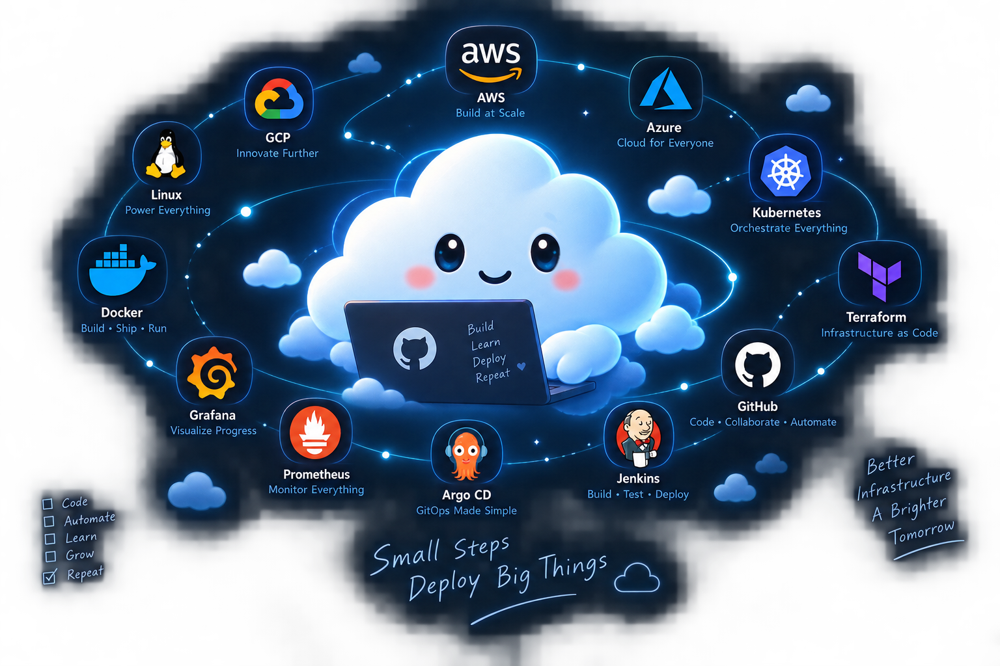

  <strong>👋 Hi, I'm Ashish</strong>
   
  <strong>☁️ Cloud & DevOps Engineer</strong>
   
   
  <strong>AWS • Kubernetes • Terraform • Docker • CI/CD</strong>

I build, automate and deploy practical cloud infrastructure and DevOps solutions.

 

### 👨‍💻 About Me

I'm a **Cloud & DevOps Engineer (Fresher)** focused on building practical cloud infrastructure, automation and Kubernetes platforms.

I learn by building hands-on projects with **AWS, Terraform, Kubernetes, CI/CD, GitOps and observability.**

### 🚀 Currently Building

**AWS Production Serverless Event-Driven Platform**

`Lambda` `API Gateway` `EventBridge`  
`SQS` `DynamoDB` `Terraform`

 

&nbsp;

&nbsp;

 

---

---

## 🛠️ Things I Like Building

  

☁️ **Cloud Infrastructure** &nbsp;•&nbsp;
⚙️ **Automation** &nbsp;•&nbsp;
☸️ **Kubernetes** &nbsp;•&nbsp;
🔄 **CI/CD** &nbsp;•&nbsp;
📊 **Observability**

---

### ☁️ A Little About How I Think

**I like turning “it works on my machine” into “it works everywhere.”**

Curious about clouds, obsessed with automation,  
and usually one `kubectl logs` away from finding out what went wrong. 😅

 

🏏 Cricket when I'm away from the terminal  
&nbsp;&nbsp;•&nbsp;&nbsp;
🎧 Music while building  
&nbsp;&nbsp;•&nbsp;&nbsp;
📚 Always learning something new

  

> **Build it. Break it. Understand it. Automate it.**

---

☁️ **Small Steps. Deploy Big Things.**

